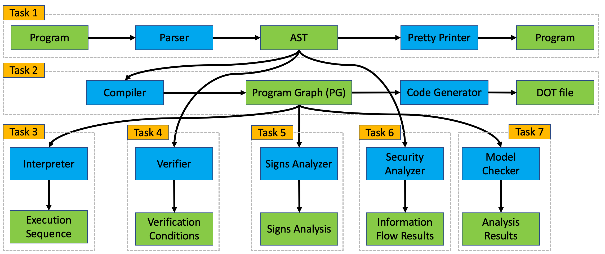

# Mandatory Assignment

> **Next Deadline: April 24, 23:59**

This provides the goals and guidelines for the mandatory assignment of course 02141 - Computer Science Modelling.
The individual tasks will be published throughout the course.

**Please read this document carefully as it explains the goals and rules of the mandatory assignment. If you find some inconsistency or unclear point, please create a gitlab issue.**

This document is structured as follows:

- [Mandatory Assignment](#mandatory-assignment)
  - [Goals of the mandatory assignment](#goals-of-the-mandatory-assignment)
  - [Guidelines](#guidelines)
  - [Feedback](#feedback)
  - [Evaluation](#evaluation)
    - [Student competition](#student-competition)
  - [Getting Started](#getting-started)

## Goals of the mandatory assignment

The overall goal of the mandatory assignment is to build a tool for running and analysing programs written in a variant of the Guarded Command Language (GCL); details of the language are described [here](gcl.md).

That is, you will learn about the most common steps one encounters when developing a new programming language.
You will also implement various tools that help programmers to write correct programs in that language.
Most components of the mandatory assignment can be seen as a basic version of [http://www.formalmethods.dk/fm4fun](http://www.formalmethods.dk/fm4fun).

The assignment is divided into seven tasks, where each tasks corresponds to a module of your tool; we will publish the task description after the deadline of the previous task has passed.

The overall structure of the assignment is illustrated below, where green boxes are inputs and outputs of your tool; blue boxes represent components that you have to implement.

We briefly describe the aims of each task:

1. In [task 1](task1.md), you will implement a *parser* that takes a program in our new programming language and turns it into an abstract syntax tree (AST) - one of the main data structures used by the other components. To test your implementation, you will also implement a *pretty printer* (i.e. a code generator) that traverses the AST and outputs the original program in a nice format.
2. In [task 2](task2.md), you will implement a *compiler* that takes the AST of a program and constructs its program graph (PG) - another data structure used for running and analyzing programs. To simplify debugging, you will also implement a *printer* that outputs a graphical representation of program graphs.
3. In [task 3](task3.md), you will implement an *interpreter* that takes a program graph and an initial memory and computes the program's (complete) execution sequences when started on that memory.
4. In tasks 4 - 7, you will implement tools that help programmers with writing correct programs:
    - In [task 4](task4.md), you will implement a *verifier* that checks whether a program does what it has been specified to do.
    - In [task 5](task5.md), you will implement a *signs analysis* that determines the signs of variables at every point of a program's execution; such information can be used to detect bugs, such as a division by zero, before actually running the program.
    - In [task 6](task6.md), you will implement another program analysis that checks whether your program leaks confidential information.
    - In [task 7](task7.md), you will implement a model checker to analyse properties of concurrent programs.

## Guidelines

- The project is intended for groups of size 2-3. If you decide to work in a smaller group, you will have a higher workload. 
- You must work in groups of size at most 3.
- You are allowed to add your own functions, types, files, etc. but ***do not modify any code in the existing files of the provided code framework unless it is explicitly allowed by a comment of the form `// TODO: start here`.***
- You have to use your group's repository on DTU gitlab to work on the mandatory assignment
  - If you do not know your group's repository, contact the teachers.
  - If you have not used git before, you can find [tutorials online](https://git-scm.com/docs/gittutorial).
- All solutions must be handed in by comitting *and pushing* them to your group's git repository.
- You can push to your group's repository as often as you want. We will consider the last push before each task's deadline as your submission.
- You can continue working on the module of a task after the deadline. However, such updates will not be evaluated.
- You have to implement your solutions within the code framework provided in this repository. 
- Your solutions must be implemented in F#.
- You have to implement the techniques presented in the teaching material.
- You are allowed to add more files but do not forget to add them to your git repository.

## Feedback

We will *not* publish solutions of any mandatory assignment tasks.

Instead, we encourage you to proactively seek feedback from the TAs and the teacher in class during lab days.

Starting with task 2, we will also provide some feedback using an automated evaluation tool.

## Evaluation

We want to encourage you to design, implement, test, and analyze your code carefully. 
Hence, your final submissions will be checked by a more powerful version of the evaluation tool.
In other words: even if the evaluation tool does not detect any errors after pushing your solutions, the final evaluation might still be able to spot some errors.

The assignment is *mandatory*: you must hand-in a *reasonable* solution for each task in order to be admitted to the final exam. This year (2022) 5 out of 6 reasonable submissions are ok.

By *reasonable*, we mean that your solution does not always have to work perfectly, but your solution should demonstrate that you can faithfully implement the techniques covered in class.
As a general guideline, if you push your solution and the evaluation tool passes 50% of the tests and there is no obvious cheating (e.g. hard-coding certain examples), you can safely assume that your solution is reasonable.

We may also manually inspect your code.

### Student competition

The student competition published [here](competition-results.md).

You can use it to compare the quality of your solution against those of your classmates. The solutions will be ranked according to the number of detected errors and their efficiency.

The group names are anonymised, i.e. you will only be able to identify the position of your own group in the ranking.
The code to identify your own group corresponds to the last 5 symbols in your group repositories name. For example, if your repository is `02141-group-99-VWXYZ`, then 
your identification code is `VWXYZ`.

Your placement in the ranking does *not* affect your final grade. You should rather see it as a motivation to produce high-quality code.

## Getting Started

Your group's repository contains the skeleton of a parser along with the input and output types for each task in the assignment. It also contains an example of a "calculator" program in F# that reads an arithmetic expression from the command line and print the result of evaluating such expression for initial testing.

We recommend going through the calculator example in your group's repository and making sure that you can build and run the example code. 

Further details are found in the [README.md](https://github.com/team-checkr/fsharp-starter) in your group's repository.
